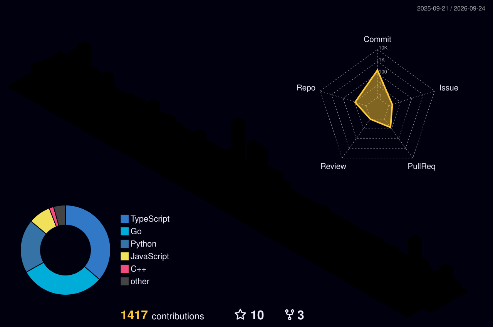

<!--
  ┌───────────────────────────────────────────────────────────────────────┐
  │  OPTIONAL: github-readme-stats cards (stats + top-languages)           │
  │  The public instance is down / rate-limited, so those two cards are    │
  │  commented out in the "GitHub Stats" section below. To enable:         │
  │    1. Fork anuraghazra/github-readme-stats and deploy the fork to      │
  │       Vercel (add env var PAT_1 = a read-only GitHub token).           │
  │    2. Uncomment the block and replace YOUR-GRS-HOST with your domain.  │
  └───────────────────────────────────────────────────────────────────────┘
-->

  

  

  
  
  
  
  

---

### 👋 About

I'm a Software Engineer who works across the stack and down into systems. Recently
wrapped a **Software Engineering Internship at Salesforce** (Network Security &amp;
Infrastructure). B.E. Computer Science &amp; Business Systems at Thapar University,
graduating 2027.

I build with **Next.js, Go, and the MERN stack**, and I like the harder corners —
a DSP audio-fingerprinting engine in Go, a fully self-hosted RAG pipeline on
`llama.cpp`, multimodal model fine-tuning. I also mentor DSA at my campus coding
society.

---

### 🛠️ Tech Stack

  <strong>Languages</strong> 
  
  
  
  
  

  <strong>Frontend</strong> 
  
  
  
  

  <strong>Backend</strong> 
  
  
  
  
  

  <strong>Data</strong> 
  
  
  
  
  

  <strong>Cloud &amp; DevOps</strong> 
  
  
  
  
  

---

### 💼 Experience

| Where | Role | When |
|---|---|---|
| **Salesforce** | SWE Intern — Network Security &amp; Infrastructure | May – Jul 2026 |
| **UQ Centre of Excellence** | Software Developer — Next.js + Go research portal | Jan – Mar 2026 |
| **DRDO (ISSA)** | AI/ML Research Intern — multimodal image captioning | Jun – Jul 2025 |

---

### 🚀 Featured Projects

| Project | What it is | Stack |
|---|---|---|
| **[AcousticDNA](https://github.com/himanishpuri/AcousticDNA)**  | Shazam-style audio fingerprinting built from scratch: STFT pipeline, spectral hashing, WASM client (~98% bandwidth cut), CLI + REST + browser | `Go` `WASM` `DSP` |
| **[Talkeys](https://github.com/TalkeysOfficial/talkeys)**  | Event discovery &amp; ticketing platform; PhonePe payments with constant-time signature verification | `Next.js` `Express` `MongoDB` |
| **[Helix](https://github.com/himanishpuri/helix_chatbot)**  | Fully self-hosted RAG chatbot on `llama.cpp` (zero external API): semantic cache 2.5s → 0.3s, SSE gateway + Redis workers | `Python` `FastAPI` `Redis` `ChromaDB` |

---

### 📊 GitHub Stats

  

<!-- Enable after deploying your own github-readme-stats (see note at top of file):

  
  

-->

---

### 🧊 Contribution Calendar (3D)

  

Animated isometric render, regenerated daily via GitHub Actions.

---

<i>Thanks for stopping by — let's build something.</i>

